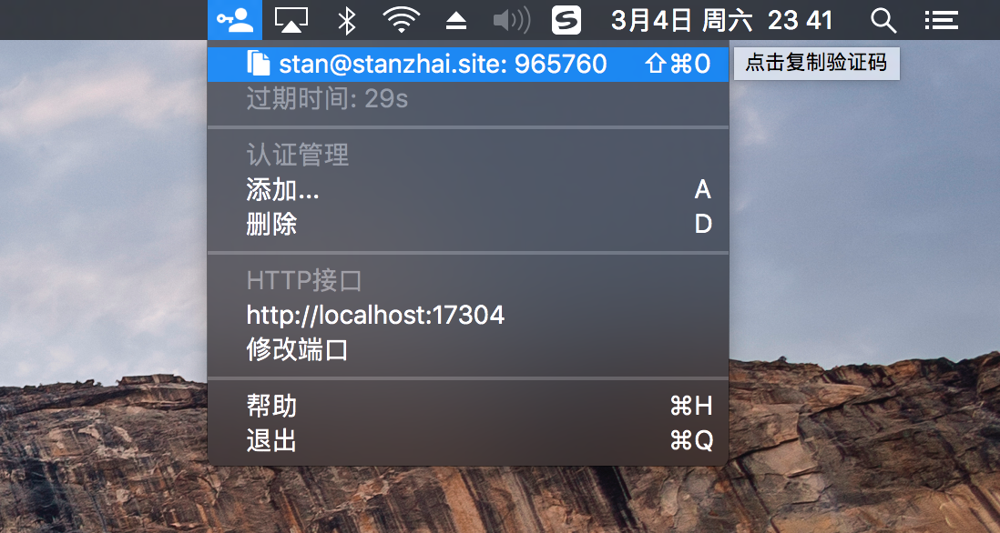
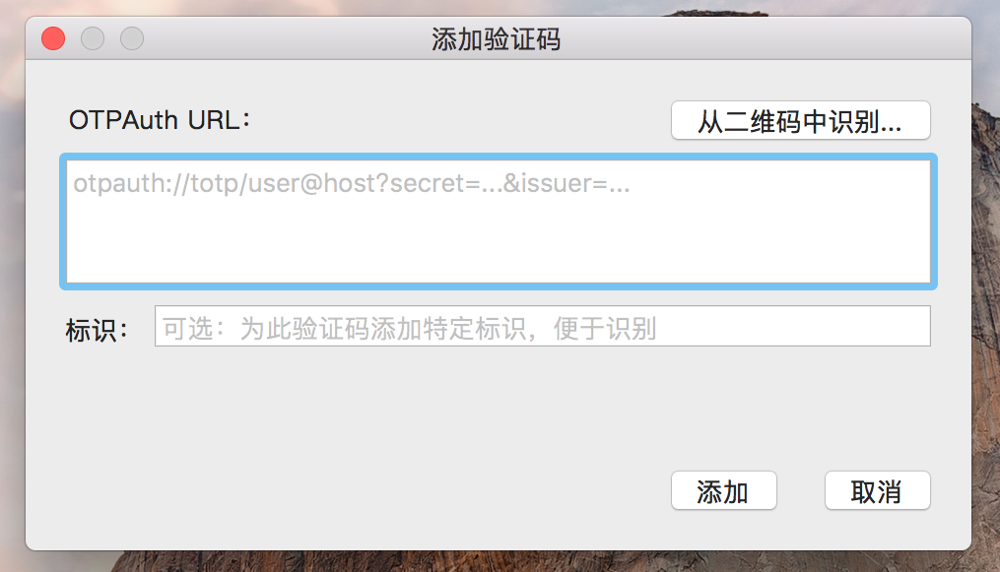
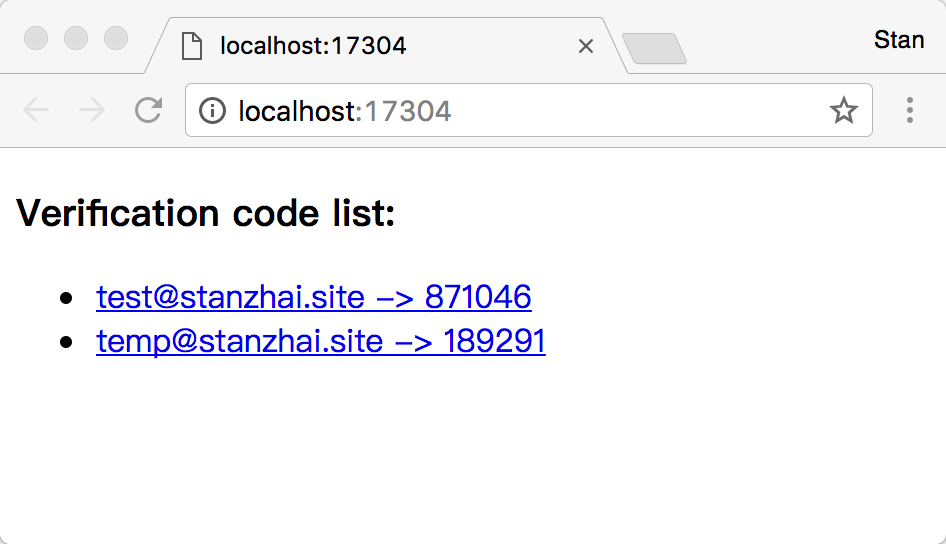

# GoldenPassport

A native implementation of Google Authenticator for Mac based on Swift3.

# Screenshot







# Features

- Recognize OTPAuth URL from a QRCode image
- Authentication code management
- Support RESTful API to obtain the verification code
- Use a global hot key(`Shift+Cmd+[0-9]`) to direct fill out the verification code
- Click an auth-menu to copy the verification code to the `PasteBoard`
- Export/Import authentication codes

# How to use

1. Download the latest version of GoldenPassport from the [releases](https://github.com/stanzhai/GoldenPassport/releases) page.
2. Unzip `GoldenPassport.zip` and put `GoldenPassport.app` to your `Application` folder then start it. 
3. Add an auth URL from the status menu.

Or you can install if from brew cask

```
brew install --cask goldenpassport
```

Now, you can get the verification code by:

- From the status menu, copy the verification by clicking an auth-menu 
- Use a global hot key(`Shift+Cmd+[0-9]`) to direct fill out the verification code

You can also use the RESTful API if you want to get the verification code from a shell script by the following way:

```
# you can get the url from `http://localhost:17304/`
code=$(curl 'http://localhost:17304/code/test@stanzhai.site')
# ues the verification code
echo $code
```

# Building

GoldenPassport uses `cocoapods` as the package manager tool, you should install it first.

1. `pod install` to install dependencies
2. Open `GoldenPassport.xcworkspace` with Xcode to build

# Todo

- Support auto startup with system
- i18n

# Resources

- [Swift Resources](https://developer.apple.com/swift/resources/)
- [macOS Development Tutorials](https://www.raywenderlich.com/category/macos)
- [google-authenticator](https://github.com/google/google-authenticator)
- [WeatherBar](http://footle.org/WeatherBar/)
- [swifter](https://github.com/httpswift/swifter)
